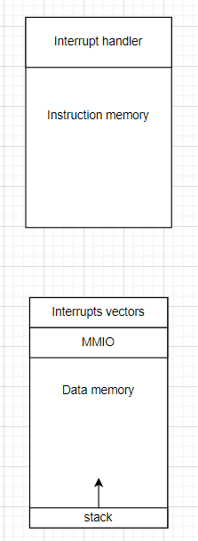
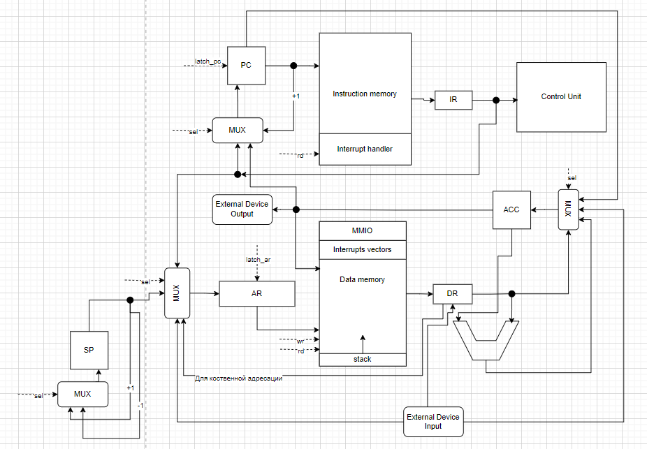
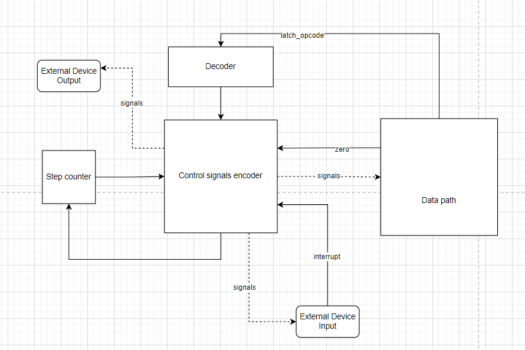

# Computer--architecture-lab3
# Транслятор и модель
- Чебоксаров Ярослав
- asm | acc | harv | hw | instr | struct | trap | mem | cstr | prob1 | spi
- Без усложнения
___
## Язык программирования
### Синтаксис
#### Форма Бекуса-Наура
- {} - item could repeat zero or more times
```ebnf
<program> ::= <line> {<line>} <end_of_file>
<line> ::= <defnition> | <statement> | <label> | <empty string>
<defenition> ::= <label> <data_type> <value>
<statement> ::= <unaddressed instruction> 
				| <addressed instruction> (<immediate_value> | <address>)
<label> ::= <some single word>":"
<data_type> ::= "num" | "string" | "char"
<unaddressed instruction> ::= cla | hlt
<addressed instruction> ::= add | load | mod | ... | jmp
<value> ::= <num> | <str> | <chr>
<num> ::= <digit> {<digit>}
<string> ::= "<char> {<char>}"
<char> ::= '([a-z] | [A-Z])'
<digit> ::= [0-9]

```
___

- Поддерживаются метки, слово в строке, оканчивающееся двоеточием, является меткой.
- ac - обозначает аккумулятор.
- Типы данных:
	- num - целое число
	- string - строка
	- char - символ

#### Семантика
- Область видимости - глобальная.
- Код ассемблера состоит из двух секций: .data(статические данные), .text(инструкции). Секции являются специальными метками, на них нельзя ссылаться из кода.
- Поддерживаются целочисленные литералы в диапазоне от -2^15 до 2^15 - 1.
- Точка входа в программу - первая инструкция после .text:
___
## Организация памяти

- Память однопортовая.
- Память команд и данных разделена
- Размер машинного слова - 32 бит.
- Память содержит 2^11 ячеек памяти(2048).
- Ячейка 2 зарезервирована под запись таблицы вектора прерывания, mem[2] - адрес первой инструкции обработчика прерываний. 
- Ячейка с адресом 0 зарезервирована под регистр ввода ВУ.
- Ячейка с адресом 1 зарезервирована под регистр вывода ВУ.
- Первая инструкция обработчика прерываний храниться в памяти инструкций в ячейке 0.
- Стек растёт вверх, начиная от ячейки 2047. Максимальный размер стека 10 ячеек.
- Размер буфера для считывания данных(для принятия ввода) -- 40 ячеек.(2037)
- **Char храниться как число( ord())**
##### Размещение программы и данных в памяти
- Статические данные(переменные, литералы) располагаются в последовательно в ячейках начиная с 3-й. 
- Буфер для приёма ввода располагается в ячейках 1998 - 2037 в памяти данных. 
- Инструкции хранятся в памяти инструкций, начиная с нулевой ячейки.
##### Виды поддерживаемой адресации
- **Прямая** : аргумент команды - адрес ячейки, из которой будет считано значение. Mem[120] = 50, load 120 <== в результате в аккумулятор загрузиться число 50.
- **Косвенная**: обозначается квадратными скобками [cell_in_mem] : load [120] => mem[mem[120]] -> mem[50], в аккумулятор загрузим значение, которое лежит по адресу 50. Если address_type == True => косвенная адресация, иначе прямая.
###### Регистры:
- ACC - аккумулятор, хранит результаты всех операций,
- IP - указатель на текущую команду,
- SP - указатель на вершину стека,
- AR - адрес данных для чтения/записи

## Система команд

Особенности процессора:
- Машинное слово -- 32 бит, знаковое.
- Размер аргумента адреса - 11 бит.
### Набор инструкций
- Кол-во тактов на исполнение инструкции без учёта тактов, которые тратятся на instruction fetch

| Язык  | Кол-во тактов | Описание                                                                                                             |
|:----- |:------------- |:-------------------------------------------------------------------------------------------------------------------- |
| load  | 1             | загрузить данные из ячейки памяти данных в аккумулятор                                                               |
| store | 1             | сохраниться данные из аккумулятора в память данных                                                                   |
| add   | 2             | операция сложения                                                                                                    |
| sub   | 2             | операция вычитания                                                                                                   |
| mod   | 2             | получить остаток от деления, который записывается в аккумулятор                                                      |
| jmp   | 1             | перейти в заданную ячейку                                                                                            |
| cmp   | 2             | сравнить два значения через вычитание, выставить флаги АЛУ, при этом в аккумулятор не заносятся результаты вычитания |
| jz    | 2             | Перейти в указанную ячейку, если поднят флаг Z                                                                       |
| jnz   | 2             | Перейти в указанную ячейку, если флаг Z **не** поднят                                                                |
| push  | 2             | Положить значение из аккумулятора на стек                                                                            |
| pop   | 2             | Выбрать значение с вершины стека в аккумулятор                                                                       |
| iret  | 3             | Возврат из прерывания                                                                                                |
| ei    | 2             | Разрешить прерывания                                                                                                 |
| di    | 2             | Запретить прерывания                                                                                                 |
| hlt   | 1             | Остановить работу процессора                                                                                         |
| jn    | 2             | Перейти в указанную ячейку, если поднят флаг N - negative                                                            |
| jnn   | 2             | Перейти в указанную ячейку, если флаг N **не** поднят                                                                |
- SP - указывает на вершину стека(ячейку памяти, которая имеет значение), если стэк пустой, то SP указывает на адрес 2048(за пределы памяти, т.к стэк пустой)
- Для выполнения команды pop, нужно сначала считать данные из памяти по указателю SP, затем инкрементировать SP:
```
1) mem[SP] -> ACC
2) SP + 1 -> SP
```
- Для выполнения команды push, нужно напротив сначала декрементировать стэк, затем по указателю SP произвести запись в память:
```
1) SP - 1 -> SP
2) mem[SP] = ACC -> mem[SP]
```
### Кодирование инструкций

- Машинный код сериализуется в список JSON.
- Один элемент списка -- одна инструкция.
- Индекс списка -- адрес инструкции. Используется для команд перехода.

Пример:

```json
[
    {
        "opcode": "load",
        "arg": 5,
        "address_type": true 
    }
]
```

где:

- `opcode` -- строка с кодом операции;
- `arg` -- аргумент (может отсутствовать);
- `address_type` -- косвенная(true) или прямая адресация.

Типы данных в модуле [isa](), где:

- `Opcode` -- перечисление кодов операций;
- `DataType` -- перечисление доступных типов данных.
### Кодирование переменных
- Переменные сохраняются в отдельный список словарей(json)
```json
[
	{
		"name": "sum",
		"type": "num",
		"val": 0,
		"l2l": false
	}
]
```

- l2l - маркер того, что в переменной содержится указатель на другую переменную. Например:
```
	question: string "What is your name?"
	pointer_q: num question
```


## Транслятор

Интерфейс командной строки: `translator.py <input_file> <target_instructions> <target_data>`
- Программа обязательно должно содержать не пустую секцию .text, а также опционально .data(при наличии переменных в программе), .data должна быть не пустой, если присутствует в программе.

Реализовано в модуле:
Этапы трансляции (функция `translate`):

1.  Предобработка: убрать пробелы и комментарии
2. Найти все лейблы и удалить их, создать файл data.json, содержащий в себе переменные(лейблы)
3. Сгенерировать машинный код

Правила генерации машинного кода:
1. Вместо лейблов подставить адреса, соответствующие данных, хранящимся в data memory.
2. Если при парсинге инструкции используется косвенная адресация, то делается соответствующая пометка(поле address_type) 

## Модель процессора

Интерфейс командной строки: `machine.py <machine_instr_file> <machine_data_file> <input_file>`

Реализовано в модуле: [machine]().
### Прерывания
- Внешнее устройство подаёт запрос на прерывание, если прерывание разрешено, то Control Unit подаёт сигнал мультиплексору и в AR поступает номер вектора прерывания.
- Прерывания обрабатываются в 3 этапа:
	- Сохранение текущего состояния процессора: сохранение текущего PC в Stack
	- Запуск Interrupt Service Routine
	- Восстановление состояния процессора
### DataPath



### ControlUnit




## Тестирование

В качестве тестов использовано четыре алгоритма:
1. hello
2. echo(cat)
3. hello user name
4. prob1
- Проект тестируется с помощью golden tests, конфигурация которых лежит в папке [golden]().

CI при помощи Github Action:

```yaml
name: Python application

on:
  push:
    branches: [ "main" ]
  pull_request:
    branches: [ "main" ]


jobs:
  test:
    runs-on: ubuntu-latest

    steps:
    - uses: actions/checkout@v4
    - name: Set up Python 3.11
      uses: actions/setup-python@v4
      with:
        python-version: "3.11"
    - name: Install dependencies
      run: |
        python -m pip install --upgrade pip
        pip install pipenv==2022.11.5
        pipenv install
    - name: Test with pytest
      run: |
        pipenv run pytest -v --update-goldens
      env:
        CI: true
  lint:
    runs-on: ubuntu-latest

    steps:
    - uses: actions/checkout@v4
    - name: Set up Python 3.11
      uses: actions/setup-python@v4
      with:
        python-version: "3.11"
    - name: Install dependencies
      run: |
        python -m pip install --upgrade pip
        pip install pipenv==2022.11.5
        pipenv install
    - name: Check code formatting with Ruff
      run: |
        pipenv run ruff format .
    - name: Run Ruff linters
      run: |
        pipenv run ruff check . 
        

```
